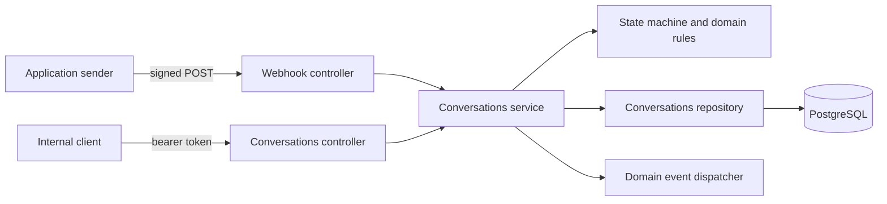

# Popp Conversation Integration

A NestJS + Prisma + PostgreSQL service for receiving job-application webhooks and managing recruitment conversations.

The service keeps webhook transport, business rules, persistence, and downstream event handling separate:



## Quickstart

### Docker Compose

The Compose stack starts PostgreSQL and the backend. The backend waits for PostgreSQL, applies committed Prisma migrations, and starts on port `3000`.

```bash
docker compose up --build
```

Check the service:

```bash
curl http://localhost:3000/health
# {"status":"ok"}
```

The API is available at `http://localhost:3000`. Swagger UI is available at `http://localhost:3000/docs`.

The repository currently has no `prisma/seed.ts` file, so there is no runnable seed step. The signed sample webhook below creates the first candidate and conversation. For a local database without the backend container, apply migrations with:

```bash
npm install
npx prisma generate
npm run prisma:migrate
npm run start:dev
```

### Create a sample conversation

Copy `.env.example` to `.env` for local Node.js execution, and export `WEBHOOK_SIGNING_SECRET` in the shell that runs the sender. For the Compose stack, use its local development secret:

```powershell
$env:WEBHOOK_SIGNING_SECRET = 'local-development-webhook-secret'
npm run webhook:send -- examples/application.json
```

The script signs the exact request body with `WEBHOOK_SIGNING_SECRET`. It posts to `WEBHOOK_URL` when set, otherwise to `http://localhost:3000/webhooks/applications`.

## Environment

| Variable | Required | Default | Description |
|---|---:|---|---|
| `NODE_ENV` | No | `development` | `development`, `test`, or `production`. |
| `PORT` | No | `3000` | HTTP listen port. |
| `DATABASE_URL` | Yes | None | PostgreSQL connection string. |
| `WEBHOOK_SIGNING_SECRET` | Yes | None | Shared secret for signed webhook requests; minimum 16 characters. |
| `API_TOKEN` | Yes | None | Bearer token for the conversations API; minimum 16 characters. |
| `STRICT_PHONE_VALIDATION` | No | `false` | Enables libphonenumber plausibility checks when `true`. |
| `WEBHOOK_TIMESTAMP_TOLERANCE_SECONDS` | No | `300` | Maximum age of a signed webhook timestamp. |
| `LOG_LEVEL` | No | `log` | Nest log level. |

Use strong, unique secrets outside local development. Compose includes local-only placeholder values so the stack can start immediately.

## API

All `/conversations` routes require `Authorization: Bearer $API_TOKEN`. Webhooks use the HMAC signature generated by `npm run webhook:send`.

### List conversations

```bash
curl -H "Authorization: Bearer $API_TOKEN" \
  "http://localhost:3000/conversations?status=CREATED&limit=50"
```

The response is `{ "data": [...], "meta": { "count": 1, "next_cursor": null } }`. Supported filters are `status`, `candidate_id`, `job_id`, `limit`, and `cursor`.

### Fetch one conversation

```bash
curl -H "Authorization: Bearer $API_TOKEN" \
  http://localhost:3000/conversations/<conversation-uuid>
```

Responses use the documented snake_case shape:

```json
{
  "id": "conversation-uuid",
  "candidate_id": "candidate-id",
  "job_id": "job-id",
  "status": "CREATED",
  "version": 0,
  "created_at": "2026-08-28T12:00:00.000Z",
  "updated_at": "2026-08-28T12:00:00.000Z"
}
```

### Change status

`version` is required. Read the conversation first and send the version you read:

```bash
curl -X PATCH \
  -H "Authorization: Bearer $API_TOKEN" \
  -H "Content-Type: application/json" \
  http://localhost:3000/conversations/<conversation-uuid>/status \
  -d '{"status":"ONGOING","version":0}'
```

Legal transitions are `CREATED -> ONGOING -> COMPLETED`. A same-status request with the current version is a `200` no-op. An impossible transition returns `422 ILLEGAL_TRANSITION`; a stale version returns `409 CONCURRENT_MODIFICATION` and should be retried after re-reading.

### Webhook

Use the helper because the signature covers the exact body bytes:

```bash
npm run webhook:send -- examples/application.json
```

Webhook outcomes are `201 CREATED`, `200 REPLAYED`, or `200 SKIPPED`. Invalid input returns `400`, and an invalid or stale signature returns `401`.

## Design Decisions

### `200` versus `409`

The status endpoint uses `409` for optimistic-lock conflicts because re-reading and retrying can succeed. It uses `422` for an illegal state-machine transition because retrying cannot make that transition legal. Same-state retries are `200` no-ops when the supplied version is current.

Webhook business-rule skips return `200`, not `409`: the event was received and evaluated successfully, and retrying will not change an R1 or R2 outcome. A machine-readable `reason` distinguishes `ACTIVE_CONVERSATION_EXISTS` from `DUPLICATE_APPLICATION`.

### Phone-number validation

The sample payload uses `+1234567890`, which is syntactically E.164 but not plausible US numbering. The hard gate checks E.164 syntax; plausibility checks are configurable with `STRICT_PHONE_VALIDATION` and default off so the supplied sample remains usable. Stored phone numbers are normalized, never the raw input.

### Database constraints over application checks

The service pre-checks duplicate and active-conversation rules to produce specific outcomes on the common path, but PostgreSQL unique indexes are the correctness authority under concurrency:

- `application_id` prevents duplicate webhook delivery from creating another row.
- `(candidate_id, job_id)` prevents repeat applications to the same job.
- A partial index on active statuses enforces one active conversation per candidate.

### State machine and optimistic locking

The domain state machine is framework-independent and permits only the strictly linear lifecycle. `CREATED -> COMPLETED` is deliberately excluded. Status writes use an atomic version-guarded update, so competing writers cannot silently overwrite one another.

### PII handling

Candidate names, phone numbers, and email addresses are personal data. Raw webhook bodies are not logged at info level, and contact data is redacted in logging paths. Retention and erasure workflows are outside this service's scope.

## Deliberately out of scope

These boundaries are intentional rather than unfinished implementation:

- **Message generation:** this service creates and advances conversations; an AI or template service owns message content.
- **SMS or WhatsApp delivery:** provider integration, delivery receipts, and channel retries belong downstream.
- **Outbox and worker:** the domain event dispatcher is the integration seam; a transactional outbox and queue worker are production evolution points, not required for this service.
- **Jobs table:** jobs are owned by the sending system, so `job_id` remains an opaque external reference with no local shadow table.
- **Retention and erasure workflows:** GDPR retention schedules, deletion requests, and audit policy need product and compliance decisions beyond this assessment.
- **Message-level contact snapshots:** a future message model should snapshot contact data at send time; there is no message table in this scope.

## Development commands

```bash
npm run build
npm run lint
npm run typecheck
npm run test:unit
npm run test:integration
npm test
```

Integration tests use Testcontainers and require Docker. Database schema changes are delivered through committed Prisma migrations; do not use `prisma db push` for this service.
